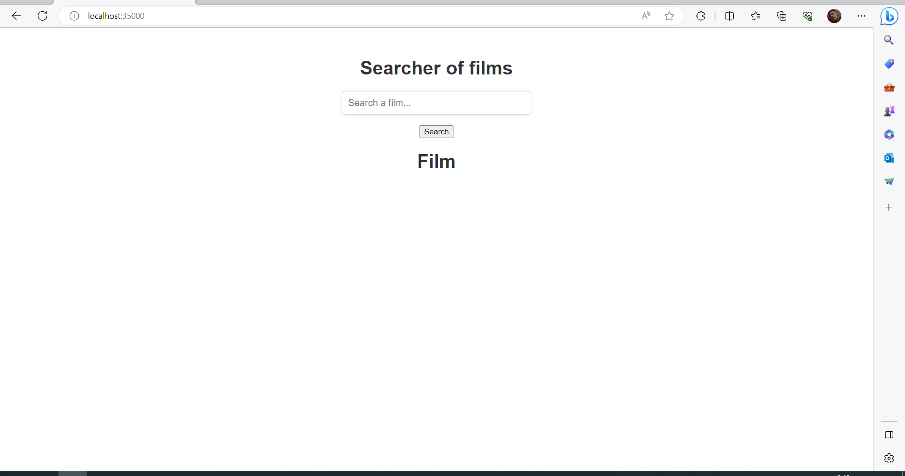

# TALLER 1: APLICACIONES DISTRIBUIDAS (HTTP, SOCKETS, HTML, JS,MAVEN, GIT)


Programa creado para buscar en la api gratis de https://www.omdbapi.com/. La aplicación recibe como parámetro el nombre de la película y muestra en pantalla los datos correspondientes en formato JSON.


### Prerequisitos

Para elaborar este proyecto se requirio de : 


Maven: Apache Maven es una herramienta que maneja el ciclo de vida del programa.


Git: Es un sistema de control de versiones distribuido (VCS).


Java 19: Java es un lenguaje de programación de propósito general orientado a objetos, portátil y muy versátil.


###Instalación


```


Clonamos el repositorio

    git clone https://github.com/julianCS21/taller01Arep.git

```
Se accede al repositorio que acabamos de clonar

	 cd HTTPserverInJava

Hacemos la construccion del proyecto

	 mvn package
---
### Corriendo
Primero corremos los siguientes comando
	
	 mvn clean package install
	 mvn clean install

Ahora corremos el servidor
	
**Windows**

	 mvn exec:java -"Dexec.mainClass"="edu.escuelaing.arep.ASE.app.webServer.HTTPServer"

**Linux/MacOs**

	 mvn exec:java -Dexec.mainClass="edu.escuelaing.arep.ASE.app.webServer.HTTPServer"

Por ultimo accedemos a nuestro navegador de confianza con la siguiente URL

	 http://localhost:35000/

Aqui nos debera de cargar la siguiente pagina, con la cual podemos empezar a hacer las busquedas que necesitemos



---
### Corriendo test

Ejecutamos el comando

	mvn Test
	
---
## Construido con

* [Maven](https://maven.apache.org/): Apache Maven es una herramienta que estandariza la configuración del ciclo de vida del proyecto.
* [Git](https://rometools.github.io/rome/):  Es un sistema de control de versiones distribuido (VCS).
* [Visual Studio Code](https://code.visualstudio.com): es un editor de código fuente desarrollado por Microsoft.
* [Java 19](https://www.java.com/es/): Lenguaje de programación de propósito general con enfoque a el paradigma de orientado a objetos, y con un fuerte tipado de variables.
* [Html](https://developer.mozilla.org/es/docs/Learn/Getting_started_with_the_web/HTML_basics): es un lenguaje de marcado que estructura una página web y su contenido.
* [JavaScript](https://developer.mozilla.org/es/docs/Learn/JavaScript/First_steps/What_is_JavaScript): lenguaje de programación que los desarrolladores utilizan para hacer paginas web dinamicas.


## Autor
* **[Julián David Castillo Soto](https://www.linkedin.com/in/julián-david-castillo-soto-118856216/)**  - [julianCS21](https://github.com/julianCS21)

## Licencia
**©** Julián David Castillo Soto, Estudiante de Ingeniería de Sistemas de la Universidad Escuela Colombiana de Ingeniería Julio Garavito.
